  

<h3 align="start">¡Hi 👋! I'm Braian 👨🏻‍💻</h3>

   <strong>AI-native Full Stack Developer</strong> 

  
  
  
  
  
  
  
  
  
  
  
  

> I build AI agents that cut costs by 70%, design systems that generate premium websites from a single codebase, and stoic habit apps with philosophers that talk back. Currently leading dev teams remotely for Europe while shipping my own products on the side.

---

##  What I'm Building

-  **[aura-agent](https://github.com/BraianTroncoso/aura-agent)** `open source · MIT` — Your personal AI agent, like *Her*, living in Telegram. It reads your email, watches your calendar, tracks your assigned PRs and issues, and writes your daily standup — reasoning on a fully **local** model so your data never leaves your machine (no API key, no cost). Light infra: SQLite + Ollama, no Docker/Postgres/Redis — a clean, hackable runtime made to fork. Not a chatbot. A second mind that remembers your context and acts on it. *(FastAPI + SQLAlchemy + SQLite + Ollama local LLM + Telegram + OpenClaw runtime)*

-  **[fracarg](https://github.com/BraianTroncoso/fracarg)** `private` — An Argentine remix of the 1997 DOS classic *Fracas*: a wizard Bomberman where you drop exploding cauldrons across ten neighbourhood arenas (Potrero, Subte, Conventillo, Cancha, Feria, La Boca, San Telmo, Abasto, Obelisco, Tigre). Story mode with an epic boss every three levels (summoner / beast / hybrid archetypes), Survival waves and a sandbox TEST mode. Wizardly power-ups — kickable & remote-detonated cauldrons, fireballs, temporary turbo and a roaring MAX aura — over a pure, deterministic, headless game core (fixed ticks + seeded RNG) so the same simulation can later run server-authoritative online. Picks your coloured wizard, carries your loadout between levels, optional Supabase accounts + leaderboards. Not a clone. A nostalgia engine for a new generation. *(Phaser 3 + TypeScript + Vite, pnpm monorepo, Zod + Vitest, Supabase, Colyseus-ready)*

-  **[DevLog](https://github.com/BraianTroncoso/devlog)** — A living, bilingual (ES/EN) logbook of applied-AI practices: a *school* (12-module curriculum, Fundamentals → Production) and a *Radar* feed that never goes stale. Context engineering, modern / agentic / Graph RAG, multitenancy & security, agents with MCP, multi-agent A2A, memory, evals / observability / guardrails and long-context — every module in one fixed didactic format (diagram, Python + TS code, mini-lab, checklist, when-NOT-to-use). Not a course that ages: every new shift in the field lands on the Radar and updates the module it touches. *(Astro + Starlight + Mermaid, i18n ES/EN)*

-  **[archetype-lab](https://github.com/BraianTroncoso/archetype-lab)** — Behavioral physics laboratory where you observe and manipulate human archetypes under simulated rules inspired by simulation theory. 8 archetypes (skeptic, believer, hedonist, stoic, meditator, ambitious, chaotic, nihilist), per-agent input/state ECS with deterministic RNG forking for A/B experiments, observer-effect LOD, coherence-biased synchronicity events, Gödel asymmetry (the agent's `decide()` physically cannot read its own `hidden_self_fact`), and a runtime admin CLI to edit beliefs and rerun divergence. Not a sandbox. A hypothesis test: change the inputs of a recursive function with mutable state and watch the output of a life diverge. *(TypeScript + Vue 3 + Vite + bitECS + PixiJS 8 + xterm.js + Dexie)*

-  **[Frontdeck](https://github.com/BraianTroncoso/Frontdeck)** `private` — Design system platform that generates premium websites where every site has its own visual identity, narrative structure, and component architecture — from a single codebase. 474+ Vue components, 22 themes, 39 block types, 200+ variants, AI-native design pipeline. Not a template. A design engine. *(Laravel 12 + Vue 3 + Filament + Inertia + GSAP + Three.js + Tailwind 4)*

-  **[Cortexa](https://github.com/BraianTroncoso/cortexa)** `private` — Digital company platform that turns your team's knowledge into AI agents with judgment, tone, and criteria. Three pillars: process automation, decision testing, and personnel cloning through `SOUL.md` files that encode real collaborators' decision heuristics. Reference implementation ships a 6-agent fintech demo (CEO, COO, HR, Finance, Legal, Sales Intelligence) with 16 skills, Series B compliance audits, and 5 planted financial anomalies. Not a chatbot. A digital twin of your company. *(Paperclip orchestration + Ollama local LLMs + custom cloning protocol + Marp decks)*

-  **[LevelUp](https://github.com/BraianTroncoso/LevelUp)** `private` — Stoic habit tracker PWA with 23 curated daily habits, an honest self-evaluation flow ("did you actually do the work before feeling bad?"), and a live chat with Marcus Aurelius, Seneca, and Epictetus powered by Llama 3.3. XP system, streaks, Memento Mori tracker, shareable progress cards. Trilingual (ES/EN/PT), fully offline-capable. *(Next.js 16 + Framer Motion + Groq AI + PWA)*

-  **[Voicepen](https://github.com/BraianTroncoso/Voicepen)** `private` — Lend your voice to an agent and let it write your social posts. Each agent encodes a real person's voice through ≥5 reference posts, archetype, expertise and audience — and the LLM mimics that exact tone when generating LinkedIn / Instagram content, grounded on fresh Google News headlines so it never invents facts. Streaming chat UI, dual mode (career-driven or agent-driven), trilingual output (ES/EN/PT), Groq → OpenRouter fallback. Not a generic AI writer. A pen that already knows your voice. *(Next.js 16 + Drizzle/Turso + Tailwind 4 + Groq)*

-  **[takeclass](https://github.com/BraianTroncoso/takeclass)** — Turn your day's git diff into an English practice session. A Claude Code skill + `/takeclass` slash command that generates warm-up vocabulary, a reading script, rephrase drills, and self-check questions from the actual code you shipped today. Built so devs can practice explaining their own work, not generic dialogues. *(Claude Code skill + slash command, MIT)*

-  **[myjarbis](https://github.com/BraianTroncoso/myjarbis)** — AI dev assistant that gives Claude Code persistent memory and structured workflows via MCP. One global MCP server serves every project through `myjarbis://` resources, backed by per-project `.myjarbis/` memory (project summary, knowledge base, daily log). Ships with intelligent code search, curated context tools, an `update_memory` API, a `myjarbis` CLI and a `doctor` healthcheck. Install once, use everywhere. *(Node.js + MCP + Bash installer, macOS / Linux / WSL2)*

-  **[GesturePilot](https://github.com/BraianTroncoso/GesturePilot)** — Control Claude Code with hand gestures and voice, from your webcam. Program standing up, dictate while walking, no keyboard needed. MediaPipe tracks 21 hand landmarks in real time, Faster-Whisper transcribes locally (no API key), Piper TTS speaks back, and a state machine (IDLE → LISTENING → PROCESSING → EXECUTING) drives an auto-submit flow with a live preview window. Native MCP integration. *(Python 3.10+ + MediaPipe + Faster-Whisper + Piper TTS, Windows / Linux / macOS)*

-  **[IwannaWork](https://github.com/BraianTroncoso/IwannaWork)** `private` — Job-hunting autopilot for LinkedIn Easy Apply. Scans `/jobs/search` for your keywords, applies automatically through the multi-step form, and watches the feed for hiring posts with contact emails. Drives Easy Apply via pure-JS shadow-DOM traversal, fingerprints each form step to escape stuck loops, and runs an adaptive throttle that calibrates itself when LinkedIn whispers "too fast". Human delays, coffee breaks, work hours, daily ceiling — simulates a tired human, not a ghost. Live Vue dashboard streams every application over SSE. *(Python + FastAPI + Vue 3 + Selenium + undetected-chromedriver + SQLite)*

-  **[GymSphere](https://github.com/BraianTroncoso/GymSphere)** `private` — Gym management platform

-  **[SecondBraian](https://github.com/BraianTroncoso/SecondBraian)** `private` — My second brain — Personal knowledge vault powered by Obsidian. PARA method, Maps of Content, 10 custom templates. Where thoughts become connections and chaos becomes clarity.

-  **[GAME-JAM-FAD-CUYO-2022](https://github.com/BraianTroncoso/GAME-JAM-FAD-CUYO-2022)** — A complete game built in under 12 hours at a game jam. Ship or die.

-  **[trainme](https://github.com/BraianTroncoso/trainme)** `open source · MIT` — A tiny CLI that preps you for a job interview without ever retyping the prompt. Keep your *persona* in a folder, hand it a job posting, and it builds a ready-to-paste context block — Claude turns it into a 1-hour roadmap, likely Q&A, a profile↔role match and stack tips; a `--fast` 15-min mode gives one line per topic. Reads `.md` / `.txt` / `.pdf` personas, language-aware output, no GUI, no server, no API key. Not a prompt you retype every time. A CLI that loads your persona and preps you in minutes. *(Python 3.10+ + Rich + pypdf + pyperclip)*

---

## GitHub Activity on Invisible Geeks

---
---

##  Dmeter — Co-Founder *(Sep 2023 – Present)*

**[dmeter.com.ar](https://dmeter.com.ar/en/)** — Digital solutions that save time, reduce errors, and grow businesses. Technology with purpose, real results.

Building and scaling the product from scratch alongside the technical and business side — architecture decisions, client delivery, and everything in between.

---

---

## 🤝 Connect

---

Random Facts

- Cut AI generation costs 70% by optimizing token architecture in production
- Build and use custom MCP servers in my daily dev workflow
- Shipped a design engine with 474+ components from a single Laravel codebase
- Finished a complete game in under 12 hours at a game jam
- Powered by mate and stoic philosophy

---

> *"Clean code, tested systems, and AI that actually ships — that's what I build."*
